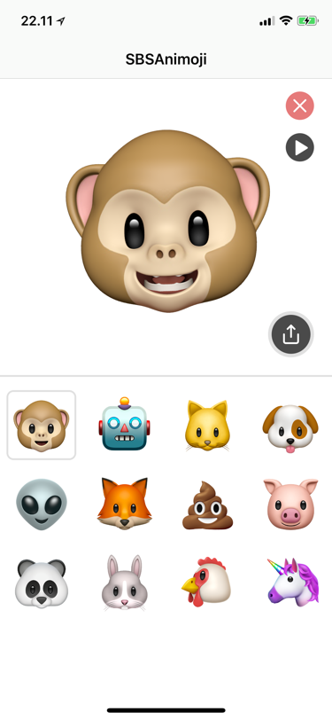

# SBSAnimoji

Fooling around with Apples private framework AvatarKit, the framework used in Messages.app for recording Animoji videos. If you are looking to create your own Animoji, take a look at [SBSCustomAnimoji](https://github.com/simonbs/SBSCustomAnimoji).

Mentions in the news:

- [9to5mac](https://9to5mac.com/2017/11/06/standalone-animoji-app-ios/)
- [The Verge](https://www.theverge.com/2017/11/7/16617018/sbsanimoji-app-animoji-developer)
- [Cult of Mac](https://www.cultofmac.com/512661/animoji-hack/)
- [Lifehacker](https://lifehacker.com/make-your-animoji-videos-twice-as-long-with-this-unoffi-1820256820)
- [MacStories](https://www.macstories.net/linked/animoji-and-avatarkit/)
- [PhoneArena](https://www.phonearena.com/news/iOS-developer-creates-stand-alone-Animoji-app-with-longer-recording-time_id99588)

### What you get

- Record Animoji videos of up to 60 seconds. Previously 20 seconds. Thanks, [Khaos Tian](https://github.com/KhaosT)!
- Share your Animoji videos with the native share sheet.
- Export videos to your photo library from the native share sheet.
- An example of how to use Apples AvatarKit.

### What you don't get

- Error handling. Should you encounter an error, try restarting the app.
- Support for the simulator. Run the app on your phone instead.

# Notice

This project relies heavily on Apples private API and you should therefore not try to submit this code to App Store.
